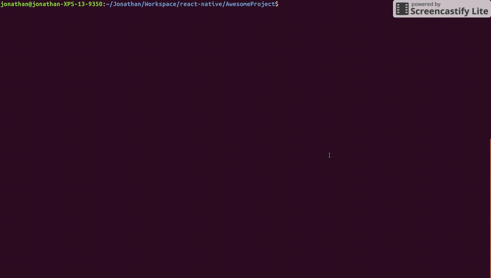

# Redux Wizards


Once upon time there was a wizard who had mastering react. But he doesn't know anything about redux. So he decided to learn redux magic spell and create a tools calles Redux Wizards.
This tool aims to make it easier to create action files, reducers files, and stores files that are used for redux technology.

## Demo


## Goals
* Shorten the time
* Uniform structure

## Usage
* `npm install -g redux-wizards`
* run in your cli `redux-wizards`
* First input your entity name ex: Hello, Session, etc
* Input your target path
* redux-wizards will create generated file

```
├── action
│   └── hello_action.js
├── reducer
│   ├── hello_reducer.js
│   └── reducer.js
└── store
    └── store.js
```

* In your root react component add these lines

```jsx
import Store from "your_app_dir/store/store.js";
import React from 'react';
import { Provider } from "react-redux";

export default class App extends React.Component {
  constructor(){
    this.store = Store.create();
    global.store = this.store;
  }

  render() {
    return(
      <Provider store={ this.store }>
        .........
      </Provider>
    );
  }
}
```

* When you want to dispatch
```jsx
.......
import HelloAction from 'your_app_dir/hello_action';
.......

export default class YourComponent extends React.Component {
    componentDidMount(){
        let action = HelloAction.elements({ YOUR_DATA_KEY: YOUR_VALUE_KEY });
        global.store.dispatch(action);
    }

    render() {
        .........
    }
}
```

## Contributing

* Feel free to open PR.

## License
ISC Licensed